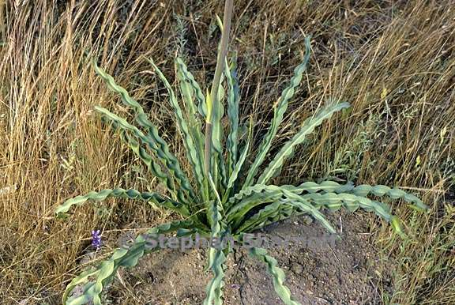

```{r knitr_init, echo=FALSE, cache=FALSE, message=FALSE, warning = FALSE}
library(knitr)
library(rmdformats)

## Global options
options(max.print="75")
opts_chunk$set(echo=TRUE,
	             cache=TRUE,
               prompt=FALSE,
               tidy=TRUE,
               comment=NA,
               message=FALSE,
               warning=FALSE,
               fig.height = 4)
opts_knit$set(width=75)
```

# How do forest charcteristics vary with respect to disturbance history at Soaproot Saddle?

### _Using random forests to classify remotely sensed forest characteristics_

```{r load_packages, echo = FALSE, message = FALSE, warning=FALSE}
## Check working directory
#getwd()

# Load our packages
library(raster)
library(rgdal)
library(ggplot2)
library(ggthemes)
library(dplyr)
library(sp)
library(neonAOP)
library(rhdf5)
library(rasterVis)
# install.packages("randomForest")
library(randomForest)

setwd("C:/Users/stellac/Box Sync/Work/neonwksp/data/NEONDI-2016/NEON_group_final/Scripts")
```

## 1. Load data

  + Load LiDAR data Canopy Height, Slope, and Aspect
  + Inspect the distributions
```{r load_LiDAR_data, echo=FALSE, fig.height = 3}
# Load LiDAR CHM raster
soap_chm<-raster("../../NEONdata/D17-California/SOAP/2013/lidar/SOAP_lidarCHM.tif")
# look at it
#summary(soap_chm)
# Load LiDAR Slope raster
soap_slope <-raster("../../NEONdata/D17-California/SOAP/2013/lidar/SOAP_lidarSlope.tif")
# Load LiDAR Aspect raster
soap_aspect <-raster("../../NEONdata/D17-California/SOAP/2013/lidar/SOAP_lidarAspect.tif")
# look at it

par(mfrow=c(1,3))
hist(soap_aspect, main = "Aspect", col = "cornflower blue")
hist(soap_chm,main = "Canopy Height", col="springgreen")
hist(soap_slope, main = "Slope", col = "purple")
par(mfrow = c(1,1))
#summary(soap_aspect)
# LiDAR data stack
LiDAR.data<-brick(soap_chm,soap_slope,soap_aspect)
```

## 2. Load Hyperspectral Indices

Next, we acquired the hyperspectral indices NDVI, SAVI, ARVI, EVI, NLDI, NDNI, and PRI for the site.

  + We don't need to see that.

```{r import_hI, echo = FALSE}
# Import the HI data
# In the absence of reflectance, we've got indices
soap_HI_NDVI<-raster("../../NEONdata/D17-California/SOAP/2013/spectrometer/veg_index/SOAP_NDVI.tif")
#plot(soap_HI_NDVI)
#summary(soap_HI_NDVI)
soap_HI_SAVI<-raster("../../NEONdata/D17-California/SOAP/2013/spectrometer/veg_index/SOAP_SAVI.tif")
#plot(soap_HI_SAVI)
#summary(soap_HI_SAVI)
soap_HI_ARVI<-raster("../../NEONdata/D17-California/SOAP/2013/spectrometer/veg_index/SOAP_ARVI.tif")
#plot(soap_HI_ARVI)
#summary(soap_HI_ARVI)
soap_HI_EVI<-raster("../../NEONdata/D17-California/SOAP/2013/spectrometer/veg_index/SOAP_EVI.tif")
#plot(soap_HI_EVI)
#summary(soap_HI_EVI)
soap_HI_NDLI<-raster("../../NEONdata/D17-California/SOAP/2013/spectrometer/veg_index/SOAP_NDLI.tif")
#plot(soap_HI_NDLI)
#summary(soap_HI_NDLI)
soap_HI_NDNI<-raster("../../NEONdata/D17-California/SOAP/2013/spectrometer/veg_index/SOAP_NDNI.tif")
#plot(soap_HI_NDNI)
#summary(soap_HI_NDNI)
soap_HI_PRI<-raster("../../NEONdata/D17-California/SOAP/2013/spectrometer/veg_index/SOAP_PRI.tif")
#plot(soap_HI_PRI)
#summary(soap_HI_PRI)
```

## 3. Brick up the vegetation indices

  We used _brick_ to get all the indices playing together
```{r make-raster-brick, echo = TRUE}
## HI data stack
HI.data<-brick(soap_HI_NDVI,soap_HI_SAVI, soap_HI_ARVI, soap_HI_EVI,soap_HI_NDLI, soap_HI_NDNI, soap_HI_PRI)
```

## 4. Load Field Measurements

  It is worth remembering that other people's data is not always perfect. 
  And that incense cedars don't grow 130 meters tall. 
  
```{r load_field_measurements, echo = TRUE}
# Load insitu veg data
soap_insitu<-readOGR("../../NEONdata/D17-California/SOAP/2013/insitu/veg-structure", "soap_stems", verbose=FALSE)

# The data says there are 17 taxonids and 16 spp, so we needed to fix the erroneous taxonid
soap_insitu$taxonid<-gsub("CAIN3", "CEIN3", soap_insitu$taxonid)
# It's fixed! Now there are 16 taxonids and 16 scientific names
```

## 5. Import index boundaries

  We extracted the flight boundaries using a special sauce
```{r import-index-boundaries, echo= TRUE }
# first import the boundaries
index.bounds.flight1 <- read.csv("../index_bounds.csv", sep=",")[,2]

```

_*But where did those index boundaries come from?*_

## 6. Identify plot boundaries

We wanted to match up our in situ data with the hyperspectral data so that we could subset a hyperspectral flight line. As a first step, we identified plot boundaries based on the stem locations in the in situ data.

  ### First, we load the in situ data as a shapefile

```{r load-insitu-data }

stem.map <- readOGR("../../NEONdata/D17-California/SOAP/2013/insitu/veg-structure",
                    "soap_stems", verbose=FALSE)

# look at a plot
chm <- raster("../../NEONdata/D17-California/SOAP/2013/lidar/SOAP_lidarCHM.tif")
plot(chm, main = "Stem locations in SOAP Terrestrial veg plots", col = bpy.colors())
plot(stem.map, pch = 20, col="white", add=TRUE)

```

### Use stem locations to create plot boundaries

```{r create-plot-boundaries}

# group stems by plotid, record the max and min northing and easting values
# this will be used later to create a shapefile for plot boundaries
stem.map.extent <- stem.map@data %>% 
  group_by(plotid) %>%
  summarise(northing.max = max(northing) + 5,
            northing.min = min(northing) - 5,
            easting.max = max(easting) + 5,
            easting.min = min(easting) - 5)

# assign new variables for use with previously created code
yPlus <- stem.map.extent$northing.max
yMinus <- stem.map.extent$northing.min
xPlus <- stem.map.extent$easting.max
xMinus <- stem.map.extent$easting.min

# code from NEON tutorial on creating square plot extents
square <- cbind(xMinus, yPlus, 
                xPlus, yPlus, 
                xPlus, yMinus, 
                xMinus, yMinus, 
                xMinus, yPlus)

ID <- stem.map.extent$plotid

```

### Create spatial polygons using the coordinates

```{r create-spatial-polygons}

# Create a function to do this
polys <- SpatialPolygons(mapply(function(poly, id) {
  xy <- matrix(poly, ncol=2, byrow=TRUE)  # take a list and create a matrix
  Polygons(list(Polygon(xy)), ID=id)
}, split(square, row(square)), ID),proj4string=CRS(as.character("+proj=utm +zone=11 +datum=WGS84 +units=m +no_defs +ellps=WGS84 +towgs84=0,0,0")))

```

### Create shapefile

```{r create-shapefile}

polys.df <- SpatialPolygonsDataFrame(polys, data.frame(id=ID, row.names=ID))

```

### Plot this with our CHM

```{r plot-square-buffers}

plot(chm, main =  "Bootstrapped plot polygons for Soaproot Saddle", col = bpy.colors())
plot(polys.df, add=TRUE)

```

### Look at all the hyperspectral flightlines

We used Leah's code to look through all the hyperspectral flightlines. I'm not going to rehash it all here, but we decided to narrow down to one flightline that covered 4 plots.

We also used Leah's code to get extents for all flightlines and saved this on our local computer.

### Set data directory to access hyperspectral flightline from hard drive
 
```{r set-data-directory, echo = FALSE }

## SOAP Clip
# the name of the site
site <- "SOAP"
domain <- "D17"
fullDomain <- "D17-California"
level <- "L1"
dataType <- "Spectrometer"
level <- paste0(site,"_L1")
year <- "2013"
productType <- paste0(site,"_", dataType)
dataProduct <- "Reflectance"

drivePath <- "D:"
#driveName <- "AOP-NEON1-4"

dataDir <- file.path(drivePath, #driveName,
                      domain,
                      site, year, level, productType, dataProduct)
#dataDir <- paste0("/", dataDir)

```

### Import flightline
```{r import-hsi-flightpaths-hidden, echo = FALSE, message = FALSE}

flight1 <- "D:/D17/SOAP/2013/SOAP_L1/SOAP_Spectrometer/Reflectance/NIS1_20130612_104651_atmcor.h5"
# thanks to Leah, we know which bands are noisy
# so only importing bands that are not noisy

# grab all bands
bands <- c(1:192,214:282,316:403)

# Hey, European Petroleum Survey Group, this is the coordinate reference system this spatial data is in. 
epsg <- 32611

# get stack
all.bands.stack.flight1 <- create_stack(flight1, 
                         bands, 
                         epsg,
                         subset=TRUE,
                         dims=index.bounds.flight1)


```

The boundaries of the flightline appears on the plot below

```{r import-flightline, eval = TRUE}

#index.bounds.flight1
plot(chm, main = "Where was the flightline relative to the plots?", col = bpy.colors())
plot(polys.df, add=TRUE, col = "white")
plot(extent(all.bands.stack.flight1), add = T, col = "white")
flight1 <- readOGR("exports/SOAP_flightLines","NIS1_20130612_104651_atmcor", verbose=FALSE)

# look at this with our plots
# plot(chm)
# plot(polys.df, add=TRUE)
#plot(flight1, add=TRUE)

```

### Identify plots within flightline

Note that 4 plots are close to the center of the flightline. We will select those 4 plots.

```{r subset-plot-shapefiles, eval = TRUE }

# choose the plots that intersect with flight 1 for extracting HSI
flight1.plots <- raster::intersect(polys.df, flight1)
#flight1.plots

# check this subset
plot(chm, col = bpy.colors(), main = "SOAP CHM")
plot(flight1.plots, add=TRUE)

```

###  Boundary for hyperspectral subset

Now we create a boundary that includes all 4 plots to subset the hyperspectral data.

```{r overall-plot-boundary, eval = FALSE}

# thanks for the code, leah!

# define the CRS definition by EPSG code
epsg <- 32611

# define the file you want to work with
# this is the hyperspectral flightline from the hard drive
f <- paste0(dataDir, "/NIS1_20130612_104651_atmcor.h5")

# define clip.extents
clip.extent <- flight1.plots

# calculate extent of H5 file
h5.ext <- create_extent(f)
#h5.ext

# turn the H5 extent into a polygon to check overlap
h5.ext.poly <- as(extent(h5.ext), 
                  "SpatialPolygons")

crs(h5.ext.poly) <- crs(clip.extent)

# test to see that the extents overlap
gIntersects(h5.ext.poly, 
            clip.extent)

# Use the clip extent to create the index extent that can be used to slice out data from the H5 file
# xmin.index, xmax.index, ymin.index, ymax.index
# all units will be rounded which means the pixel must occupy a majority (.5 or greater)within the clipping extent

index.bounds <- vector("list", length(clip.extent))
index.bounds <- calculate_index_extent(extent(clip.extent),
								h5.ext)
#index.bounds

# this is what i wrote to a csv!

```

#### _and now back, to the hyperspectral questions_

## 7. Import flightpaths previously identified
  This flightpath brought to you by Leah Wasser. Thanks Leah!
  
```{r import-hsi-flightpaths}

flight1 <- "D:/D17/SOAP/2013/SOAP_L1/SOAP_Spectrometer/Reflectance/NIS1_20130612_104651_atmcor.h5"
```

## 8. Extract bands from flightpaths
  We want a band or lots of bands, but a nice, quiet band. Not a noisy one. And no stupid hats, please.
```{r extract-bands }
# thanks to Leah, we know which bands are noisy
# so only importing bands that are not noisy

# grab all bands
bands <- c(1:192,214:282,316:403)

#or, if you only want RGB
bands_rgb <- c( 58,34,19)

# Hey, European Petroleum Survey Group, this is the coordinate reference system this spatial data is in. 
epsg <- 32611

# get stack
all.bands.stack.flight1 <- create_stack(flight1, 
                         bands, 
                         epsg,
                         subset=TRUE,
                         dims=index.bounds.flight1)

rgb.bands.stack.flight1 <- create_stack(flight1, 
                         bands_rgb, 
                         epsg,
                         subset=TRUE,
                         dims=index.bounds.flight1)

```

## 9. Now, we can see where the information is coming from
  A little slice of Sierra Nevada called Soaproot Saddle
  This is a small corner of the extent at Soaproot
  The overlay is from our flight of interest.
  
## 10. Examine the spectra to be used for analysis 
  
```{r inspect-spectral-location}
# check via plotting to make sure we got the right areas
plot(soap_chm,xlim = c(296800,298000), col = bpy.colors(), main = "SW corner of Soaproot Saddle n/ Flight Path 1")
#extent of the hsi flight stack
#in appropriate colors
plot(extent(all.bands.stack.flight1),add = T, col = "cornflower blue", size =2)
# the rgb bands for that region
plotRGB(rgb.bands.stack.flight1,stretch ="lin",add=T)

# also take a look at the wavelength plots

# get spectra for each band
spectra.flight1 <- extract_av_refl(all.bands.stack.flight1, aFun = mean)
spectra.flight1 <- as.data.frame(spectra.flight1)

# read in the wavelength information from the HDF5 file
wavelengths<- h5read(flight1, "wavelength")

# convert wavelength to nanometers (nm)
wavelengths <- wavelengths * 1000
spectra.flight1$wavelength <- wavelengths[bands]

# plot spectra
spectra_plot <- qplot(x=spectra.flight1$wavelength,
      y=spectra.flight1$spectra.flight1,
      xlab="Wavelength (nm)",
      ylab="Reflectance",
      main="Spectra for all pixels\n Soaproot Saddle Flightpath 1",
      ylim = c(0, .35), colour=spectra.flight1$wavelength)
spectra_plot + theme_few()

```

##And now, a bit of classification

##Next: why this pattern? Is it related to a disturbance?



###The end. 


